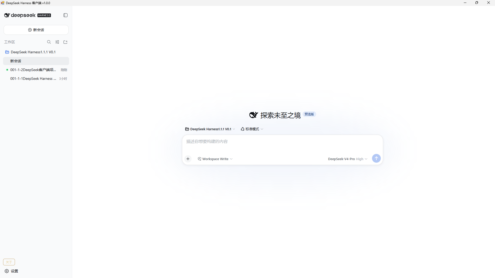
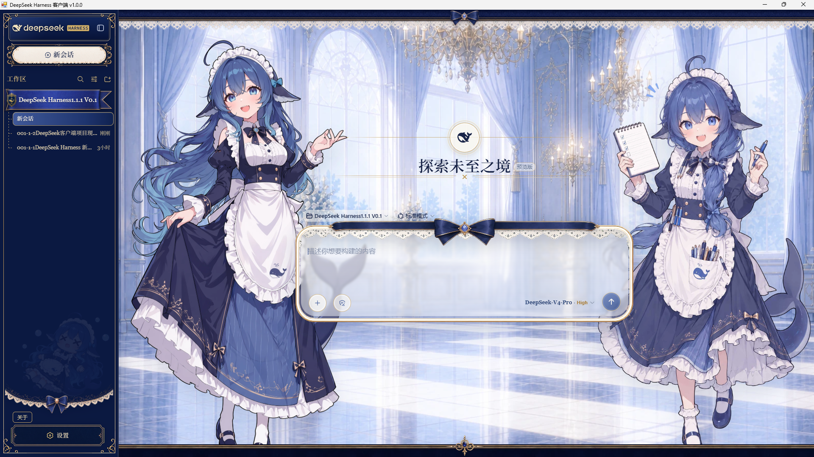
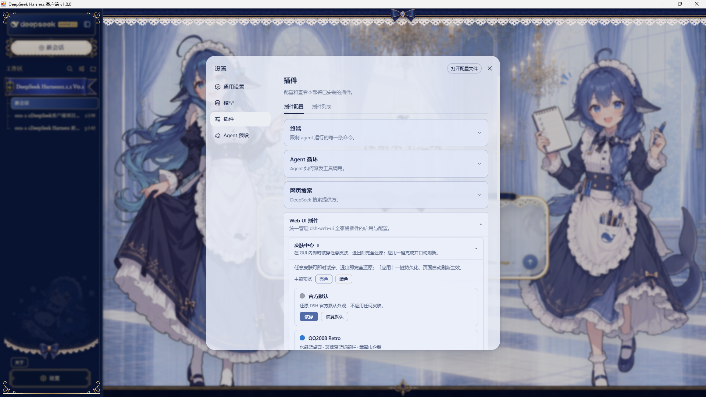

# DeepSeek Harness 桌面客户端

> **版本 v1.0.0** · 作者 **Muxue-Dev（幻曦之殇）**
> GitHub：https://github.com/Muxue-Dev ｜ B站：https://space.bilibili.com/110628804

> ⚠️ **声明**：作者只是一名**普通开发者**，本项目是**个人业余开源作品**，与 **DeepSeek（深度求索）官方无关**，并非官方软件。个人能力有限、**随缘维护**（不保证及时更新和修复），仅供免费交流学习，请见谅。

## 📥 下载安装包（永久免费）

**夸克网盘下载（推荐，不限次数）：**
- 链接：https://pan.quark.cn/s/37a8b3710a3d
- 提取码：`87Ft`

**安装方法**：下载后右键解压 → 双击里面的「安装.exe」→ 装好即用（桌面自动出快捷方式）。

> ⚠️ 本软件**永久免费**。若你在别处被要求**付费**才能下载，那是被人倒卖了，请认准本仓库免费获取。

## ✨ 这是什么

把 DeepSeek Harness（DSH，网页版 AI 助手）封装成一个独立的 Windows 桌面软件：WebView2 内嵌窗口 + 内置 Node，双击就能用，适合完全不懂电脑的小白用户。

## ⭐ 三大亮点

- 🎨 **好看**：附「深海女仆工坊」双女仆皮肤展示（免费第三方皮肤，见下方截图）
- 🖱️ **小白友好**：一键安装，内置运行环境，不用配环境变量
- 🚀 **国内直连**：夸克网盘下载，不限次数、速度快

## ✨ 主要功能

- 真·应用窗口：用 Edge WebView2 把网页内嵌进程序窗口（无地址栏、无标签页）
- 内置独立 Node.js（runtime\node），不依赖 WorkBuddy
- 复用后台：打开/关闭客户端都不杀后台，不影响正在进行的对话
- 软件图标 + 加载页 + 「关于」页（版本 / GitHub / B站链接）

## 🎨 皮肤（可选 · 免费）

软件默认是官方界面（如上图）。想要「深海女仆工坊」双女仆皮肤（下图），可自行安装。

**皮肤项目**：[dsh-deep-whale](https://github.com/Small-tailqwq/dsh-deep-whale)（作者 Small-tailqwq）

**安装方法（懒人版）**：装好客户端后，对你的 AI 助手说一句：
> 安装一下这个皮肤包：https://github.com/Small-tailqwq/dsh-deep-whale

装好后：设置 → 插件 → Web UI 插件 → 皮肤中心 → 选「深海女仆工坊」。

**版权与许可**：
- 本皮肤为衍生创作，整体以 **CC BY-NC-SA 4.0**（署名-非商业性使用-相同方式共享）发布，**禁止商业使用**。
- 署名链：
  - 原作：**上善**（鲸鱼娘角色形象，Pixiv · Bilibili：上善无形）
  - 二次创作：**拉链管 ZipZipPipe**（加入 DeepSeek 元素的女仆鲸鱼娘设计，Bilibili：拉链管道）
  - 皮肤：**Small-tailqwq**
- 皮肤问题请到皮肤项目的 [Issue](https://github.com/Small-tailqwq/dsh-deep-whale/issues) 反馈，勿打扰上面两位原作者。

## 📖 怎么用

1. 下载安装包，解压，双击「安装.exe」
2. 双击桌面「DeepSeek Harness 客户端」
3. 想退出：点窗口右上角 ×（只关窗口，后台服务继续运行）

## 🔧 从源码编译

- 环境：Windows + .NET Framework 4.x（系统自带 csc.exe）+ WebView2 SDK DLL
- 方法：运行 `源码\build.bat` 一键重新编译生成 exe

## 📂 目录结构
DeepSeek-Harness-Client.exe 主程序 Microsoft.Web.WebView2.*.dll 内嵌浏览器（WebView2） WebView2Loader.dll 内嵌浏览器加载器 runtime\node\node.exe 内置独立 Node.js config.txt 配置（路径都在这里改） 源码\launcher.cs 客户端源码（C#） 源码\build.bat 一键编译脚本

## 📄 开源协议

- 客户端源码：MIT License
- 「深海女仆工坊」皮肤为第三方作品（CC BY-NC-SA 4.0），不随本仓库分发，请到皮肤项目获取
